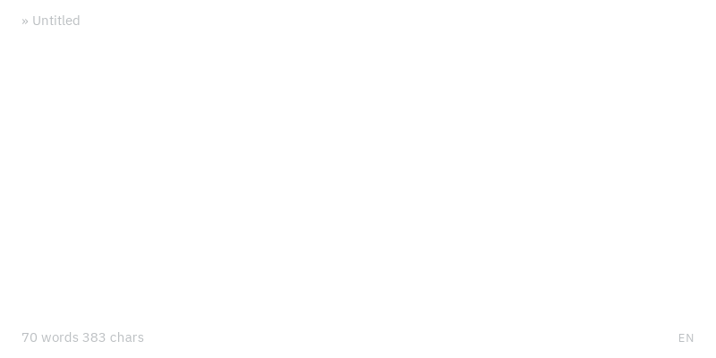

  

  A minimalist, keyboard-only markdown editor made for writing

  
  
  
  

  

Blank shows your text as it will look, without toolbars or buttons. You format with the keyboard or by typing markdown, and Blank takes care of the typography.

- **Keyboard only:** headings, lists, links and formatting are one shortcut away
- **Autocorrect as you type:** typographic quotes, dashes and arrows in 14 languages, modelled on Word and LibreOffice
- **Plain markdown files**, with PDF export
- **Six themes**, from light to black
- **Never lose a word:** Blank restores your document on the next start

## Download

- **macOS:** [Apple Silicon](https://github.com/FPurchess/blank/releases/download/v2.0.0/blank_2.0.0_aarch64.dmg) · [Intel](https://github.com/FPurchess/blank/releases/download/v2.0.0/blank_2.0.0_x64.dmg)
- **Windows:** [Installer (.msi)](https://github.com/FPurchess/blank/releases/download/v2.0.0/blank_2.0.0_x64_en-US.msi) · [Setup (.exe)](https://github.com/FPurchess/blank/releases/download/v2.0.0/blank_2.0.0_x64-setup.exe)
- **Linux:** [.deb](https://github.com/FPurchess/blank/releases/download/v2.0.0/blank_2.0.0_amd64.deb) · [.rpm](https://github.com/FPurchess/blank/releases/download/v2.0.0/blank-2.0.0-1.x86_64.rpm) · [AppImage](https://github.com/FPurchess/blank/releases/download/v2.0.0/blank_2.0.0_amd64.AppImage)

**macOS** blocks Blank on first open because it isn't notarized by Apple. **Linux** needs glibc 2.35+ and WebKitGTK 4.1 (Ubuntu 22.04+, Debian 12+). See the [install guide](https://fpurchess.github.io/blank/guide/install) for both.

## Keyboard shortcuts

`Mod` is `Cmd` on macOS and `Ctrl` on Windows and Linux.

| Command                      | Shortcut                    |
| ---------------------------- | --------------------------- |
| Save / Open / New file       | `Mod S` / `Mod O` / `Mod N` |
| Heading 1 – 6 / Paragraph    | `Mod 1` … `Mod 6` / `Mod 0` |
| Bullet list / Numbered list  | `Mod 8` / `Mod 9`           |
| Bold / Italic / Code         | `Mod B` / `Mod I` / `Mod E` |
| Insert link                  | `Mod K`                     |
| Export as PDF                | `Mod Alt P`                 |

All shortcuts, and how to change them, are in the [documentation](https://fpurchess.github.io/blank/guide/shortcuts).

## Documentation

**[fpurchess.github.io/blank](https://fpurchess.github.io/blank/)** covers [writing in Blank](https://fpurchess.github.io/blank/guide/writing), [autocorrect and languages](https://fpurchess.github.io/blank/guide/autocorrect), [themes](https://fpurchess.github.io/blank/guide/themes), [configuration](https://fpurchess.github.io/blank/guide/configuration) and the [FAQ](https://fpurchess.github.io/blank/guide/faq).

## Contributing

Bug reports, ideas and pull requests are welcome. [Open an issue](https://github.com/FPurchess/blank/issues/new/choose), or read [CONTRIBUTING.md](CONTRIBUTING.md) to set up the project.

## License

Distributed under the [**GNU Affero General Public License v3.0 only**](LICENSE).

## Acknowledgments

Blank is built on [Tauri](https://tauri.app/), [ProseMirror](https://github.com/ProseMirror/) (thanks to [@marijnh](https://github.com/marijnh) and [@adrianheine](https://github.com/adrianheine)) and [Vite](https://github.com/vitejs/vite), and set in [IBM Plex Sans](https://github.com/IBM/plex).
