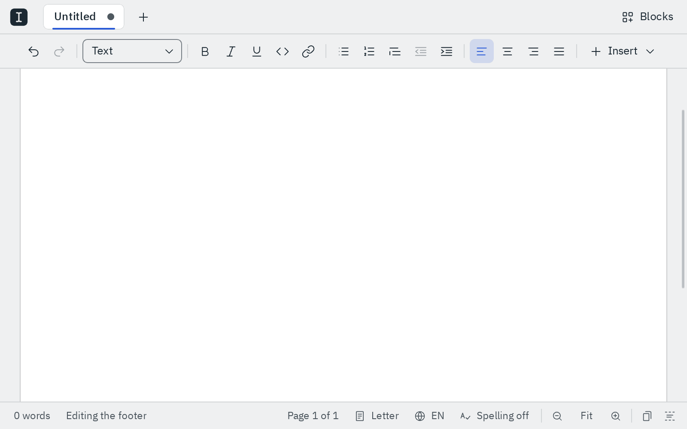

  

  <em>A quiet place to write.</em>

  
  
  
  

  

Every piece of writing begins the same way: an empty page, a blinking cursor, and the quiet question of what comes next.

Blank is made for that moment and for everything after it. There are no toolbars, no buttons, no panels asking for your attention. There is the page and the sentence you are writing. Your hands stay on the keyboard, and the formatting follows them: type `#` and a space, and a heading appears, press `Mod` `I` and your words lean into italics.

The small things take care of themselves. Quotes curl, dashes find their length, and a new sentence starts with a capital letter in the language you write in. When you are ready to proofread, spell check underlines what it doesn't know and offers what you meant. Close the window mid-thought and Blank keeps your words for the next time you open it.

Underneath, it's plain markdown, so your writing stays yours, readable by any editor for as long as you keep it.

What you see is what you print. Blank sets your text in pages as you write, and every line and every page ends on the screen exactly where it ends in the PDF, headers, footers and page numbers included. [See your pages](https://blank-writer.xyz/guide/pages).

## Download

- **macOS:** [Apple Silicon](https://github.com/FPurchess/blank/releases/download/v3.0.0/blank_3.0.0_aarch64.dmg) · [Intel](https://github.com/FPurchess/blank/releases/download/v3.0.0/blank_3.0.0_x64.dmg)
- **Windows:** [Installer (.msi)](https://github.com/FPurchess/blank/releases/download/v3.0.0/blank_3.0.0_x64_en-US.msi) · [Setup (.exe)](https://github.com/FPurchess/blank/releases/download/v3.0.0/blank_3.0.0_x64-setup.exe)
- **Linux:** [.deb](https://github.com/FPurchess/blank/releases/download/v3.0.0/blank_3.0.0_amd64.deb) · [.rpm](https://github.com/FPurchess/blank/releases/download/v3.0.0/blank-3.0.0-1.x86_64.rpm) · [AppImage](https://github.com/FPurchess/blank/releases/download/v3.0.0/blank_3.0.0_amd64.AppImage)

**macOS** blocks Blank on first open because it isn't notarized by Apple. **Linux** needs glibc 2.35+ and WebKitGTK 4.1 (Ubuntu 22.04+, Debian 12+). See the [install guide](https://blank-writer.xyz/guide/install) for both.

## Keyboard shortcuts

A handful of shortcuts is all it takes to begin. `Mod` is `Cmd` on macOS and `Ctrl` on Windows and Linux.

| Command                     | Shortcut                    |
| --------------------------- | --------------------------- |
| Save / Open / New tab       | `Mod S` / `Mod O` / `Mod N` |
| Next tab / Close tab        | `Ctrl Tab` / `Mod W`        |
| Heading 1 – 6 / Paragraph   | `Mod 1` … `Mod 6` / `Mod 0` |
| Bullet list / Numbered list | `Mod 8` / `Mod 9`           |
| Bold / Italic / Code        | `Mod B` / `Mod I` / `Mod E` |
| Insert link                 | `Mod K`                     |
| Insert table                | `Mod T`                     |
| Export as PDF / Word        | `Mod Alt P` / `Mod Alt W`   |

All shortcuts, and how to change them, are in the [documentation](https://blank-writer.xyz/guide/shortcuts).

## Documentation

Everything else lives on **[blank-writer.xyz](https://blank-writer.xyz/)**: [writing in Blank](https://blank-writer.xyz/guide/writing), [tables](https://blank-writer.xyz/guide/tables), [files and formats: PDF and Word](https://blank-writer.xyz/guide/files), [autocorrect in 14 languages](https://blank-writer.xyz/guide/autocorrect), [spell check](https://blank-writer.xyz/guide/spelling), the [six themes](https://blank-writer.xyz/guide/themes), [your own shortcuts and settings](https://blank-writer.xyz/guide/configuration) and the [FAQ](https://blank-writer.xyz/guide/faq).

## Contributing

Bug reports, ideas and pull requests are welcome. [Open an issue](https://github.com/FPurchess/blank/issues/new/choose), or read [CONTRIBUTING.md](CONTRIBUTING.md) to set up the project.

## License

Distributed under the [**GNU Affero General Public License v3.0 only**](LICENSE).

## Acknowledgments

Blank is built on [Tauri](https://tauri.app/), [ProseMirror](https://github.com/ProseMirror/) (thanks to [@marijnh](https://github.com/marijnh) and [@adrianheine](https://github.com/adrianheine)) and [Vite](https://github.com/vitejs/vite), and set in [IBM Plex Sans](https://github.com/IBM/plex).
